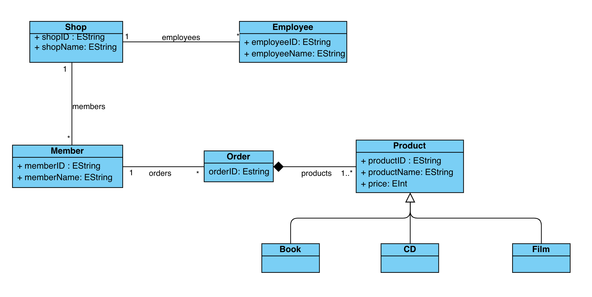

# Shop Example

## Structure



- [/editor](./editor) - Simple command-line editor containing necessary commands to create and manipulate the Shop model.
- [/metamodel](./metamodel) - Metamodel of Shop
- [/facilites](./facilities) - Contains the helper function to print out a Shop model in a readable form.

## Execute

1. Open a terminal and start the server in [/lowkey/network](./lowkey/network): ```python Server.py -log debug```.
2. Open a number of editor clients in [/editor](./editor) in separate terminals: ```python Editor.py -log debug```.
3. Refer to the command language below to start modeling.

### Command Language
**For available types and the right name of associations, please refer to the [`ShopPackage.py`](./metamodel/ShopPackage.py)**

**Commands are case-sensitive.**

#### Local Commands
1. `READ` - Returns the Shop model in a readable form.
2. `OBJECTS` - Lists every object in the local session.
3. `SHOWVIEW` - Present the view of the model in a readable form (With nodes conformed to the types specified in correspondent ViewPoint)
   - User will be prompted to enter the name of the `View`

#### Global Commands
1. `CREATE [type] [name]` - Creates an instance with name `[name]` of the domain-specific type `[type]`.
    - Ex: `CREATE Shop Shop1`, `CREATE Product Product1`
2. `LINK [source].[port] TO [target]` - Links object `[target]` to object `[source]` via port `[port]`.
    - Ex: `LINK Shop1.members TO Member1`, `LINK Shop1.employees TO Employee1`
3. `UPDATE [name] [attribute] [newValue]` - Updates attribute `[attribute]` in object with `[name]` to value `[newValue]`.
    - Ex: `UPDATE Shop1 shopName Shop2`, `UPDATE Film1 price 20`
4. `CREATEVIEWPOINT {[Types]} [ViewPointName]` - Create a view point with name `[ViewPointName]` and types `{[Types]}`.
    - Ex: `CREATEVIEWPOINT {Employee, Members} EmployeeMemberViewPoint` (ViewPoint will only contain nodes from Shop model that are either Employee or Member)
5. `APPLYVIEW [EntityName] [ViewPointName] [ViewName]` - Apply view point `[ViewPointName]` to entity `[EntityName]` and name the view `[ViewName]`.
    - Ex: `APPLYVIEW Shop1 EmployeeMemberViewPoint EmployeeMemberView` (View will only contain nodes from Shop1 that are either Employee or Member)
6. ~~`DELETE [name]` - Deletes object `[name]`~~ (Not currently supported, but will be in the future)

#### General remarks

Local commands will not be sent to the server. Thus they will not be recorded or broadcasted to other clients. 

Global commands will be sent to the server and will be recorded and broadcasted to other clients. **With the exception of `CREATEVIEWPOINT` and `APPLYVIEW` which will not be broadcasted to other clients.**
